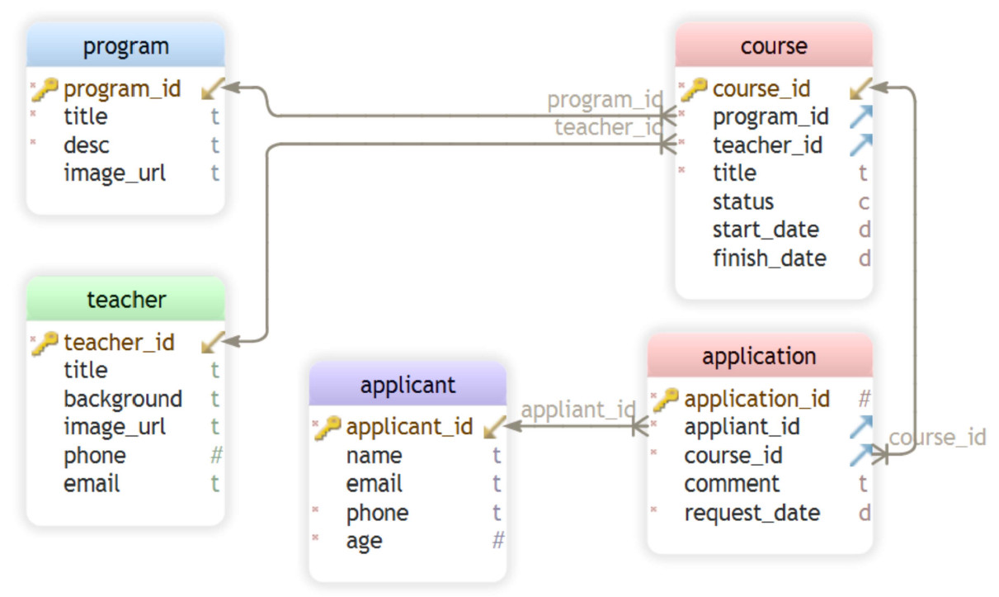

# ComIT-NodeJS Project
A sample teaching and tutoring responsive website
## Features
* It comes with 6 HTML pages including Home (as landing page), Programs, Teachers. Courses, Links and Contact
* Programs: main category of the tutoring service, e.g "Applied Science"
* Courses: are defined under each program; e.g. "Physics 20" or "Physics 30" under "Applied Science" program
* Teachers: are defined separatelly and then, can be allocated to 0 to many courses (not functionlal in this version yet)
* Applicants: are users that can applly for one or more courses 
* Applications: a transaction in which an applicant (user) can apply for a specfic course 
## Platform
### Frontend
* HTML: Structure is based on html and html templates
* Bootstrap: for styling the html I used bootstrap and 
* CSS: a little bit CSS wherever bootstrap does not have desired facilities 

### DB model
* MongoDB: used for db model and design of data
* Mongoose:  The data are modeled based on normalised db model, i.e. dividing the data into multiple collections with references between those collections and usingpopulate methods and queries accordingly

### Backend
* Nodejs: used as server-side platform
* Express: to provide methods, call HTTP verb ( GET , POST , SET , etc.) and URL pattern ("Route")
* ejs: for rendering htmls 

## Future Expansion
* Add more CRUD freatures (currently the app can only add new programs, courses, applicants and applications, the rest should be implemented directly through MongoDB compass)
* Add various reports using Mongoos's aggregate and populate methods and features 

